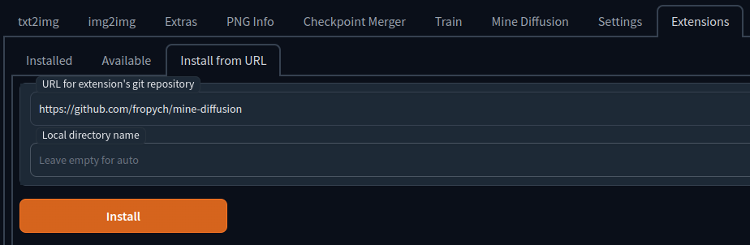

# Mine Diffusion extension

A extension for [AUTOMATIC1111/stable-diffusion-webui](https://github.com/AUTOMATIC1111/stable-diffusion-webui), which allows you to easily import images into Minecraft using litematica mod

    
    
    

    
    
    

    

## Installation

The extension can be installed directly from within the **Extensions** tab within the Webui
