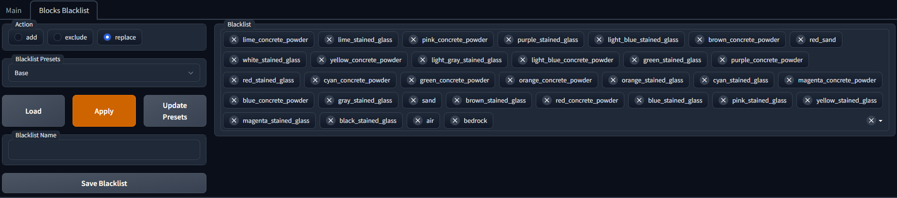

# Mine Diffusion extension for Stable-Diffusion-WebUI

A extension for [AUTOMATIC1111/stable-diffusion-webui](https://github.com/AUTOMATIC1111/stable-diffusion-webui), which allows you to easily import images into Minecraft using [Litematica](https://www.curseforge.com/minecraft/mc-mods/litematica) mod

    

    

## Installation

The extension can be installed directly from within the **Extensions** tab within the Webui

You also need a Litematic mod to import the scheme into minecraft

## Usage

### __Main Tab__
*__Vertical__* - changes orientation from horizontal to vertical  
*__Flip__* - mirrors the image  
*__Rotation__* - the angle at which to rotate the image  
*__Schematic Size__* - adjusts the size in the game (large values take processing time)

### __Blocks Blacklist__

The blocks selected here will not participate in the transformation of the image into minecraft blocks

*__Action__* - what to do with the current blacklist when loading a preset  
*__Load__* - loads the selected preset  
*__Apply__* - applies the selected preset  
*__Update Presets__* - updates the list of presets (for example, if you have saved a new preset, click this button)
